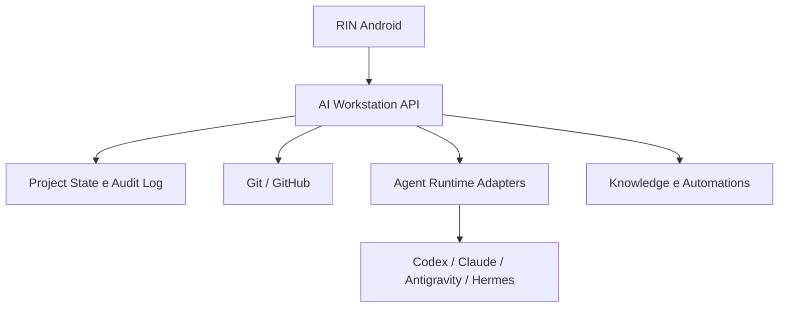

# AI Workstation

Plataforma pessoal de IA de Rafael executada no Galaxy Book/PC. É o cérebro e o nó de execução do ecossistema; o [RIN](https://github.com/playertwo1/rin) é seu aplicativo Android.

## Organização do produto

| Nome | Papel | Repositório |
|---|---|---|
| AI Workstation | API, execução, agentes, Git, memória, políticas, auditoria e automações | este repositório |
| RIN | Aplicativo Android e Control Plane móvel | `playertwo1/rin` |
| Projeto Vivo | Primeiro módulo do RIN para continuidade de projetos | `playertwo1/rin` |

O antigo “RIN Server” e o antigo backend do “Projeto Vivo” convergem aqui como **AI Workstation Node/API**. Não haverá dois servidores concorrentes.

## Missão

Fornecer serviços headless, seguros e substituíveis para que o RIN possa:

- saber onde cada projeto parou;
- consultar estado Git e evidências;
- acompanhar sessões;
- enviar comandos tipados;
- aprovar ações sensíveis;
- passar o turno entre agentes;
- receber eventos e resultados confirmados.

## Arquitetura

## Estado atual

Fase 0: fronteiras consolidadas e documentação em revisão. Ainda não há código de produção. O primeiro caminho vertical será uma API simulada com health, capabilities e projetos, consumida pelo RIN.

## Comece por aqui

- [Divisão dos repositórios](docs/12-divisao-rin-aiworkstation.md)
- [Visão da plataforma](docs/01-visao-produto.md)
- [Escopo do MVP](docs/02-escopo-mvp.md)
- [Arquitetura](docs/03-arquitetura-inicial.md)
- [Roadmap](docs/04-roadmap.md)
- [Backlog](docs/05-backlog-inicial.md)
- [Decisões e hipóteses](docs/06-decisoes-e-hipoteses.md)
- [Segurança](docs/07-seguranca.md)
- [Síntese histórica](docs/08-sintese-da-conversa.md)
- [Briefing para Codex Astra](docs/09-briefing-codex-astra.md)
- [Glossário](docs/10-glossario.md)
- [Trilha Hermes](docs/11-trilha-hermes.md)
- [Instruções para agentes](AGENTS.md)

## Regra de foco

O MVP implementa a fundação da plataforma necessária ao Projeto Vivo, sem código Android neste repositório e sem misturar dados bancários do Diretor 360.
