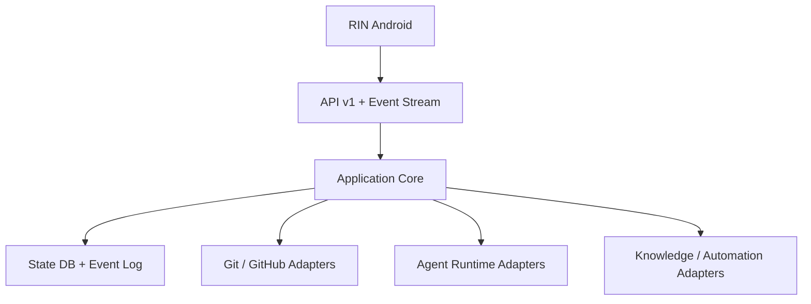

# Arquitetura inicial da AI Workstation

## Topologia



## Camadas

### API e segurança

- API versionada em `/api/v1`.
- Pareamento e identidade revogável de dispositivo.
- Intenções tipadas, idempotência, rate limit e erros estruturados.
- WebSocket ou SSE decidido por ADR.
- Sem shell genérico.

### Application Core

- projetos, sessões, checkpoints, eventos, handoffs e approvals;
- policy engine;
- fila serial por projeto;
- supervisor, timeout, cancelamento e recuperação;
- capabilities por adaptador.

### Persistência

- banco transacional como autoridade operacional;
- event log append-only;
- exportações atômicas e recuperáveis;
- evidência vinculada às afirmações;
- segredos fora de banco comum e logs.

### Adaptadores

- Git/GitHub;
- `AgentRuntimeProvider` para fake, Codex, Claude, Antigravity e Hermes;
- `KnowledgeProvider` para Markdown/Obsidian;
- automações determinísticas;
- monitor de recursos.

## Fontes de verdade

| Domínio | Autoridade |
|---|---|
| Código e commits | Git/GitHub |
| Estado operacional | banco/event log da AI Workstation |
| Conhecimento permanente | Markdown/Obsidian, se adotado |
| Memória curta | runtime, nunca canônica isoladamente |
| Procedimentos | skills versionadas e aprovadas |
| Cache e preferências móveis | RIN/Room |

## Contrato com RIN

A plataforma publica health, capabilities, projetos, eventos, comandos e approvals. Mudanças incompatíveis exigem nova versão. O RIN nunca acessa banco, filesystem, CLI ou formato interno de provedor diretamente.

## Estrutura pretendida

```text
apps/node/
packages/contracts/
packages/core/
packages/persistence/
packages/adapters/
tools/simulators/
docs/adr/
```

## Recursos

O Galaxy Book6 Pro de 32 GB roda serviços headless. Concorrência, RAM, CPU, disco e energia serão medidos. Workers ficam ociosos/suspensos quando possível, e o futuro Modo Jogo deverá pausar e restaurar serviços com estado persistido.
