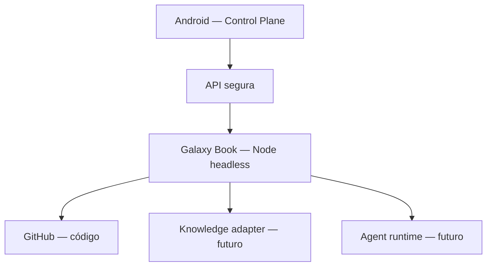
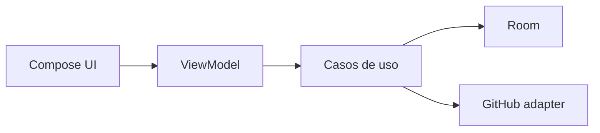

# Arquitetura inicial

## Topologia alvo

## Entrega em duas etapas

### Etapa A — MVP local-first

- Android nativo com Kotlin e Jetpack Compose.
- Material 3.
- Arquitetura em camadas, evitando complexidade prematura.
- Room como armazenamento local.
- WorkManager para sincronizações adiáveis.
- GitHub atrás de uma interface de repositório.

### Etapa B — nó headless

- Serviço leve no Galaxy Book, preferencialmente em WSL/Linux.
- API autenticada e restrita.
- Descoberta de capacidades do nó.
- Filas de tarefas, logs estruturados e idempotência.
- Runtime de agentes escolhido somente após spike.

## Componentes e fontes de verdade

| Domínio | Fonte de verdade | Observação |
|---|---|---|
| Código e commits | Git/GitHub | Nunca inferir código atual só pela memória |
| Estado exibido no MVP | Banco local do app | Sincronizável e auditável |
| Conhecimento permanente | Obsidian, se adotado | Markdown; não é banco operacional |
| Memória de agente | Runtime de agente | Curta/operacional e governada |
| Procedimentos | Skills versionadas | Mudança via proposta e aprovação |
| Dados estruturados futuros | PostgreSQL | Especialmente serviços compartilhados |
| Automação determinística | n8n/scripts | Não usar LLM quando regra basta |

## Entidades iniciais

### Project

`id`, `name`, `description`, `status`, `priority`, `repositoryUrl`, `defaultBranch`, `workingBranch`, `currentAgent`, `blockedReason`, `nextStep`, `createdAt`, `updatedAt`.

### Checkpoint

`id`, `projectId`, `summary`, `workDone`, `decisions`, `problems`, `nextStep`, `agent`, `createdAt`, `sourceType`, `sourceRef`.

### Decision

`id`, `projectId`, `title`, `context`, `decision`, `consequences`, `status`, `createdAt`.

### WorkItem

`id`, `projectId`, `type`, `title`, `status`, `priority`, `sourceRef`, `updatedAt`.

### SyncState

`entityType`, `entityId`, `localVersion`, `remoteVersion`, `state`, `lastAttemptAt`, `errorCode`.

## Contratos antes de integrações

Interfaces sugeridas:

- `ProjectRepository`
- `CheckpointRepository`
- `SourceControlProvider`
- `KnowledgeProvider`
- `AgentRuntimeProvider`
- `NodeGateway`
- `ApprovalService`
- `ResourceMonitor`

O MVP implementa apenas as necessárias. As demais podem começar como contratos/documentação, sem frameworks ou serviços falsos.

## Recursos do Galaxy Book

O desenho considera 32 GB de RAM e execução headless. Orçamento preliminar, a ser medido na máquina real:

- manter reserva de RAM para Windows e desenvolvimento;
- limitar concorrência de workers;
- suspender serviços não essenciais em bateria ou sob pressão;
- permitir futuro “Modo Jogo” com pausa e retomada segura;
- nunca depender de percentuais estimados sem telemetria real.

