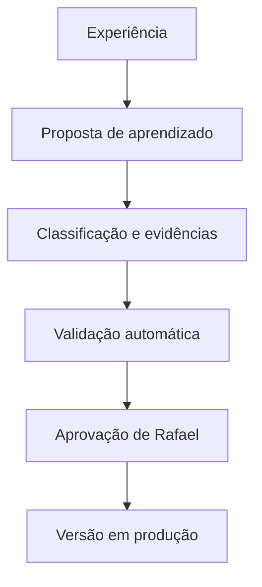

# Síntese preservada da conversa

Este documento registra a evolução conceitual discutida até 2026-09-11. É uma síntese fiel das ideias e decisões, não uma transcrição literal integral.

## Origem

O Projeto Vivo surgiu como um gerenciador Android para projetos feitos com vibe coding. Ele deveria reunir GitHub, última alteração, bugs, decisões, próximos passos e a IA que estava trabalhando. A pergunta central era: **“Onde parei e como continuo?”**

Também surgiu o desejo de alternar entre serviços de IA por assinatura. A conversa concluiu que isso não pode ser tratado como uma capacidade genérica garantida: cada provedor possui autenticação, limites, planos e termos próprios, que precisam de validação atual e oficial.

## Evolução com Hermes

Hermes foi considerado como possível camada de runtime de agentes, especialmente por conceitos como:

- agent loop;
- profiles/bots;
- sessões e busca;
- memória e skills;
- propostas de escrita com aprovação;
- cron e tarefas sem agente;
- subagentes;
- sandbox e execução restrita;
- abstração de providers.

A decisão foi não realizar um fork grande imediatamente. Primeiro deverá existir um spike isolado, com métricas, segurança e decisão documentada. Hermes não deve substituir automaticamente n8n, PostgreSQL ou camadas específicas de evidência.

## Evolução com Obsidian

Obsidian foi identificado como potencial Knowledge Hub baseado em Markdown. Seu papel é conservar conhecimento permanente, decisões, arquitetura, aprendizados e relações entre projetos.

Separação proposta:

- GitHub: verdade do código.
- Obsidian: conhecimento permanente.
- runtime do agente: memória operacional.
- skills: procedimentos versionados.
- PostgreSQL/Room: dados estruturados.
- n8n/scripts: automações determinísticas.
- Projeto Vivo: experiência de controle.

O Obsidian não deve se tornar banco operacional nem ser obrigatório no núcleo do MVP. A primeira integração deve ser por arquivos Markdown abertos; CLI/Headless entram apenas depois de prova de valor.

## Arquitetura física

O Galaxy Book6 Pro de 32 GB foi escolhido como pequena AI Workstation. A preferência é executar serviços headless, evitando interfaces e camadas desnecessárias. O Android será o painel móvel; o notebook executará integrações e orquestração; modelos complexos permanecerão preferencialmente na nuvem.

Foi proposta uma futura gestão de recursos capaz de:

- medir CPU, RAM, disco, temperatura/energia quando disponível;
- limitar concorrência;
- manter workers adormecidos quando ociosos;
- pausar serviços não essenciais;
- integrar o futuro “Modo Jogo” e restaurar o ambiente com segurança.

## Plataforma maior

Em uma visão posterior, Projeto Vivo e Diretor 360 poderiam compartilhar uma infraestrutura chamada provisoriamente `Rafael AI Platform`:

- Projeto Vivo como vertical de gestão/orquestração de desenvolvimento;
- Diretor 360 como vertical bancária;
- componentes genéricos compartilhados: runtime, skills, approvals, sessões, cron, sandbox e providers.

Porém, a decisão atual é adiar essa plataforma. O desenvolvimento começa pelo Projeto Vivo e não mistura dados ou regras bancárias.

## Learning Gate

Uma ideia central preservada é o gate de aprendizado:

Nunca deve existir o caminho direto “a IA concluiu algo → virou memória/regra de produção”.

## Decisão de recorte

O primeiro produto não será a orquestração completa. Será o menor fluxo que resolve continuidade:

1. cadastrar projetos;
2. registrar checkpoints;
3. mostrar status, decisões, bugs e próximo passo;
4. integrar GitHub em modo leitura;
5. provar o valor de “Onde parei?”.

Depois serão adicionados nó headless, Obsidian, runtime de agentes, providers e Learning Gate, cada qual com spike e gate próprio.

