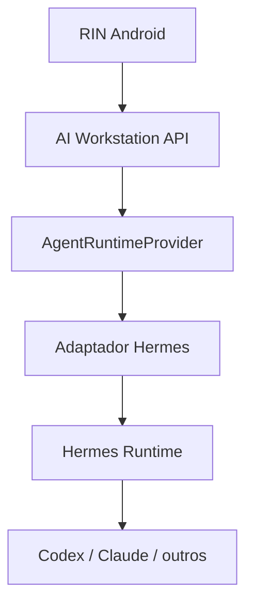

# Trilha Hermes

## Papel esperado

Hermes é candidato a runtime/orquestrador de agentes da **AI Workstation**. Pode evitar reconstruir sessões, profiles, busca, skills, memória operacional, cron, subagentes, approvals e execução controlada.

Hermes não é a AI Workstation nem o RIN. A plataforma preserva estado, contratos, políticas e evidências; o RIN oferece a experiência móvel.

## Posição

`AgentRuntimeProvider` é fronteira obrigatória. API, domínio e banco principal não dependem de formatos internos do Hermes.

## Fase H0 — POC

Em ambiente isolado e repositório descartável:

1. Instalar em ambiente equivalente ao Galaxy Book/WSL.
2. Registrar versão, licença, atualização e maturidade.
3. Criar profile de teste.
4. Iniciar, observar, cancelar e retomar sessão.
5. Testar persistência e pesquisa.
6. Testar skill simples e versionada.
7. Testar proposta de memória/skill sem autopromoção.
8. Testar subagente e consolidação.
9. Testar cron com e sem LLM.
10. Validar sandbox, workspace e bloqueio destrutivo.
11. Validar autenticação oficial de cada provider.
12. Medir RAM, CPU, disco, início e falhas.

## Provas

- **H0-01 Onde parei:** resumo comparado com Git/checkpoints.
- **H0-02 AI Shift:** segunda sessão compreende estado, decisão, bloqueio e próximo passo.
- **H0-03 Cancelamento:** processo encerra e não aparece como sucesso.
- **H0-04 Learning Gate:** proposta não entra em produção sem aprovação.
- **H0-05 Recuperação:** reinício gera estado interrompido e retomável.

## Matriz de decisão

| Critério | Peso |
|---|---:|
| Segurança e approvals | 5 |
| Persistência e retomada | 5 |
| Cancelamento e verdade do estado | 5 |
| Compatibilidade Windows/WSL | 4 |
| API/eventos | 4 |
| Isolamento por projeto | 4 |
| Providers oficiais | 3 |
| Skills, sessões e busca | 3 |
| Consumo de recursos | 3 |
| Licença e manutenção | 3 |

Decisão: `adotar por adaptador`, `adaptar componentes`, `continuar estudando` ou `descartar`.

## Integração, se aprovada

### H1 — Serviço isolado

- roda no Galaxy Book/WSL;
- somente capabilities permitidas;
- sessão/workspace por projeto;
- recursos limitados;
- tokens nunca chegam ao RIN.

### H2 — Retomada

- lê Git, estado, checkpoints e contexto autorizado;
- produz proposta com evidências;
- aguarda políticas.

### H3 — Execução

- branch/worktree isolada;
- eventos estruturados;
- cancelamento;
- diff e testes;
- push/PR/merge conforme política explícita.

### H4 — Aprendizado

- proposta classificada;
- evidências e validação;
- aprovação de Rafael;
- versionamento e rollback.

## Hermes não substitui

| Componente | Responsabilidade |
|---|---|
| Git/GitHub | verdade do código |
| Banco/event log | estado operacional |
| Obsidian | conhecimento permanente |
| n8n/scripts | automação determinística |
| AI Workstation | contratos, políticas, auditoria e plataforma |
| RIN | UX, decisões e controle móvel |

## Limites

Sem projeto real no POC, token no RIN/Git/log, shell genérico, burla de quota, autopromoção, ação destrutiva, falso sucesso ou Hermes como fonte única do estado.
