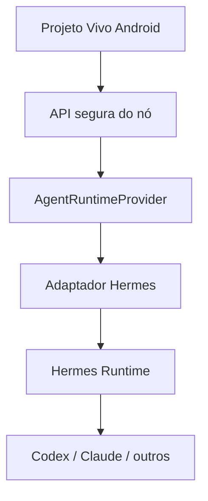

# Trilha Hermes

## Papel esperado

Hermes é o principal candidato a **runtime/orquestrador de agentes** do Projeto Vivo. Ele pode evitar que o projeto reconstrua do zero recursos genéricos como sessões, profiles, busca de histórico, skills, memória, cron, subagentes, approvals e execução controlada.

Hermes não é o Projeto Vivo. O aplicativo continua responsável pela experiência móvel, estado do projeto, evidências, permissões e decisões do usuário.

## Posição na arquitetura

O `AgentRuntimeProvider` é a fronteira obrigatória. Nenhuma tela, caso de uso ou banco principal deverá depender diretamente de classes, arquivos ou formatos internos do Hermes.

## Fase H0 — POC antes da adoção

Executar em ambiente isolado e repositório descartável:

1. Instalar no ambiente headless equivalente ao futuro Galaxy Book/WSL.
2. Registrar versão, licença, método de atualização e maturidade do projeto.
3. Criar um profile de teste do Projeto Vivo.
4. Iniciar, observar, cancelar e retomar uma sessão.
5. Testar persistência e pesquisa de sessões.
6. Testar uma skill simples e versionada.
7. Testar proposta de memória/skill com aprovação, sem autopromoção.
8. Testar um subagente e consolidar o resultado.
9. Testar cron com tarefa sem LLM e tarefa com agente.
10. Validar sandbox, isolamento de workspace e bloqueio de comando destrutivo.
11. Validar autenticação oficial de cada provider separadamente.
12. Medir RAM, CPU, disco, tempo de inicialização e comportamento em falha.

## Casos de prova

### H0-01 — Onde parei?

Hermes recebe um repositório descartável, encontra arquivos contextuais permitidos, consulta a sessão anterior e devolve um resumo com fontes. O resumo é comparado com Git e checkpoints conhecidos.

### H0-02 — Passar turno

Um agente encerra uma tarefa com checkpoint estruturado; uma segunda sessão recebe somente o contexto necessário e consegue explicar estado, decisão, bloqueio e próxima ação.

### H0-03 — Cancelamento real

Uma tarefa longa é cancelada. O processo encerra, o estado fica coerente e o sistema não declara sucesso.

### H0-04 — Learning Gate

O runtime propõe uma memória ou skill. A proposta permanece fora de produção até aprovação explícita; rejeição não pode ser contornada.

### H0-05 — Falha e recuperação

O processo é reiniciado durante uma tarefa. O Projeto Vivo identifica o estado como interrompido, recupera evidências e permite retomada segura.

## Matriz de decisão

Cada item recebe evidência e nota de 0 a 3:

| Critério | Peso |
|---|---:|
| Segurança e approvals | 5 |
| Persistência e retomada | 5 |
| Cancelamento e verdade do estado | 5 |
| Compatibilidade headless Windows/WSL | 4 |
| Integração por API/eventos | 4 |
| Isolamento por projeto | 4 |
| Providers oficiais realmente utilizáveis | 3 |
| Skills, sessões e busca | 3 |
| Consumo de recursos | 3 |
| Licença, manutenção e atualizações | 3 |

Possíveis decisões:

- **Adotar por adaptador:** atende aos critérios críticos e permanece substituível.
- **Adaptar componentes:** aproveitar ideias ou módulos sem usar o runtime inteiro.
- **Continuar estudando:** evidência insuficiente; não bloquear o MVP.
- **Descartar:** risco, incompatibilidade ou custo supera o benefício.

## Integração progressiva, se aprovado

### H1 — Serviço no nó

- Hermes roda no Galaxy Book, nunca dentro do app Android.
- API do nó oferece capabilities explícitas, não shell genérico.
- Uma sessão e workspace por projeto/tarefa.
- Recursos e concorrência limitados.

### H2 — Retomada assistida

- ler Git, `PROJECT_STATE.md`, checkpoints e contexto autorizado;
- produzir “Onde parei?” com evidências;
- propor plano e aguardar política de autorização.

### H3 — Execução controlada

- trabalhar apenas em branch/worktree isolada;
- transmitir eventos estruturados;
- permitir cancelamento;
- mostrar diff e testes;
- push/PR/merge conforme política explícita.

### H4 — Skills e aprendizado

- propostas classificadas como memória, procedimento ou regra;
- evidências obrigatórias;
- validação automática;
- aprovação de Rafael;
- versionamento e rollback.

## Relação com outros componentes

| Componente | Responsabilidade | Hermes não deve substituir |
|---|---|---|
| Git/GitHub | Verdade do código | histórico e branches |
| Room/PostgreSQL | Estado estruturado | banco principal |
| Obsidian | Conhecimento permanente | Knowledge Hub |
| n8n/scripts | Fluxos determinísticos e integrações | automação previsível |
| Projeto Vivo | Controle, UX, evidências e políticas | produto principal |

## Limites inegociáveis

- não modificar projetos reais durante o POC;
- não armazenar tokens no Android, Git ou logs;
- não expor shell genérico;
- não burlar quotas, planos ou termos de assinatura;
- não promover memória, skill ou regra automaticamente;
- não fazer force-push, limpeza destrutiva ou mudança de remote;
- não declarar sucesso sem confirmar o efeito;
- não transformar Hermes em fonte única do estado do projeto.

